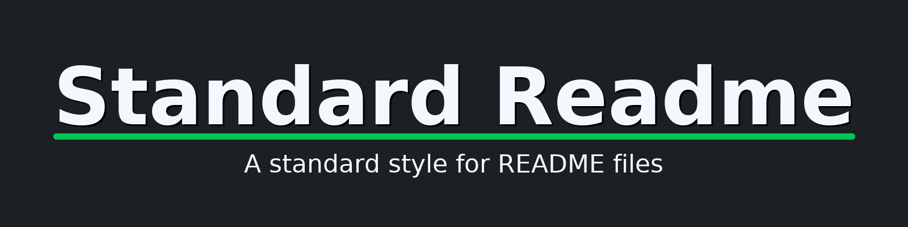

# Title




[](LICENSE)
[](https://github.com/RichardLitt/standard-readme)

This is an example file with maximal choices selected.

This is a long description.

## Table of Contents

- [Security](#security)
- [Background](#background)
- [Install](#install)
- [Usage](#usage)
- [API](#api)
- [Contributing](#contributing)
- [License](#license)

## Security

### Any optional sections

## Background

### Any optional sections

## Install

This module depends upon a knowledge of [Markdown]().

```
```

### Any optional sections

## Usage

```
```

Note: The `license` badge image link at the top of this file should be updated with the correct `:user` and `:repo`.

### Any optional sections

## API

### Any optional sections

## More optional sections

## Contributing

See [the contributing file](CONTRIBUTING.md)!

PRs accepted.

Small note: If editing the Readme, please conform to the [standard-readme](https://github.com/RichardLitt/standard-readme) specification.

### Any optional sections

## License

[MIT © Richard McRichface.](../LICENSE)
